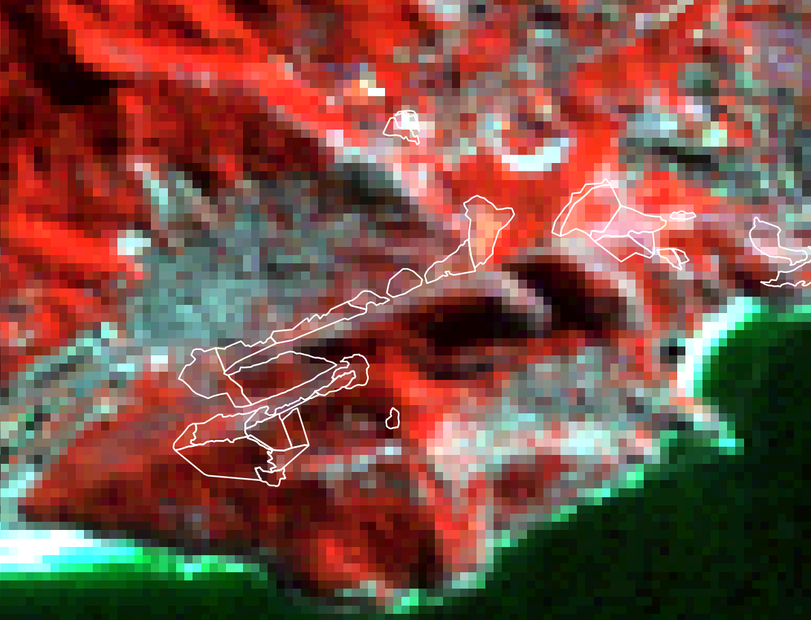
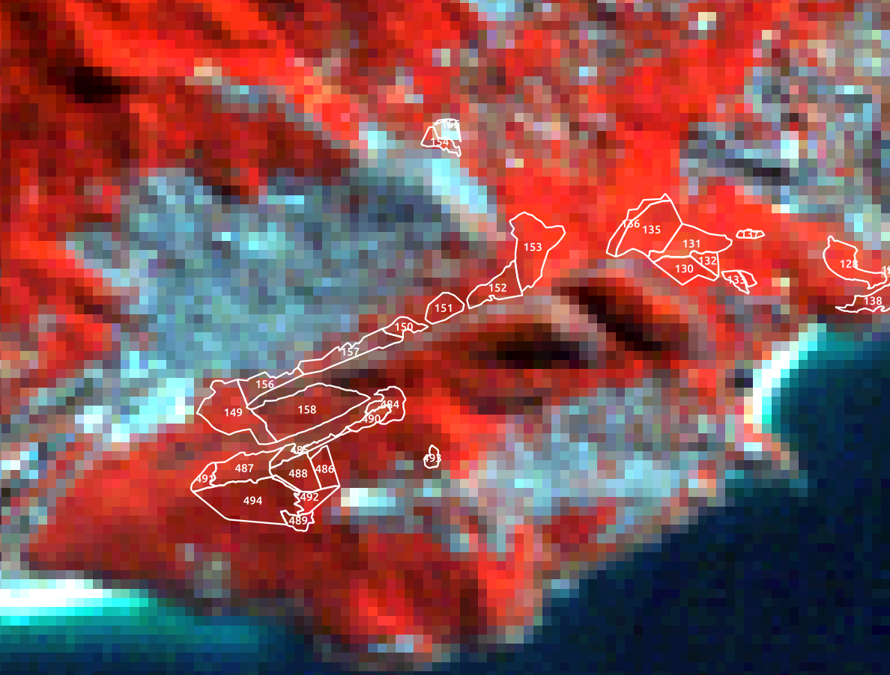
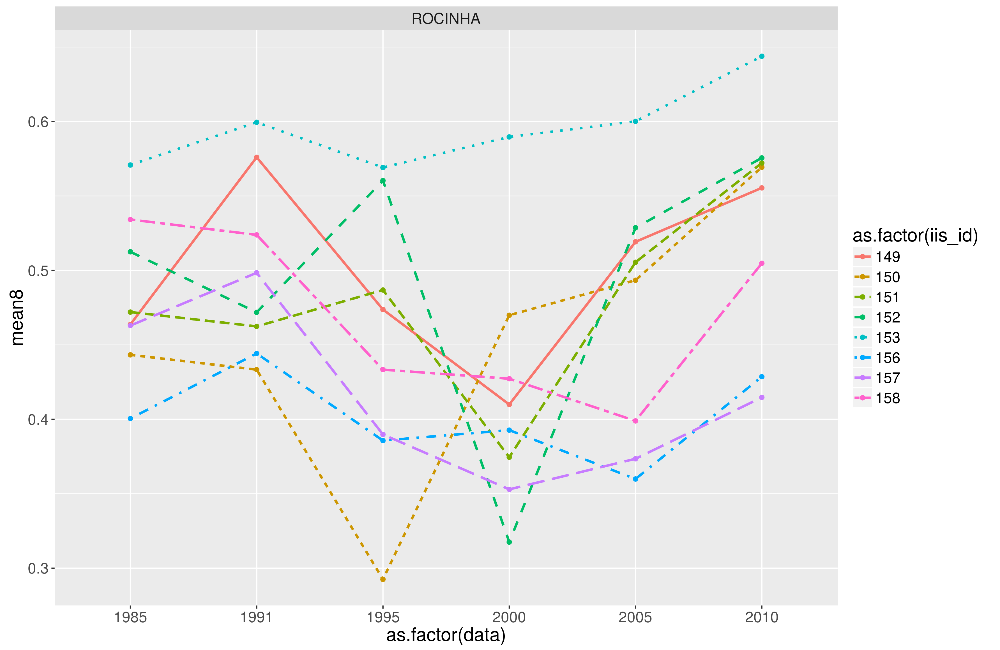
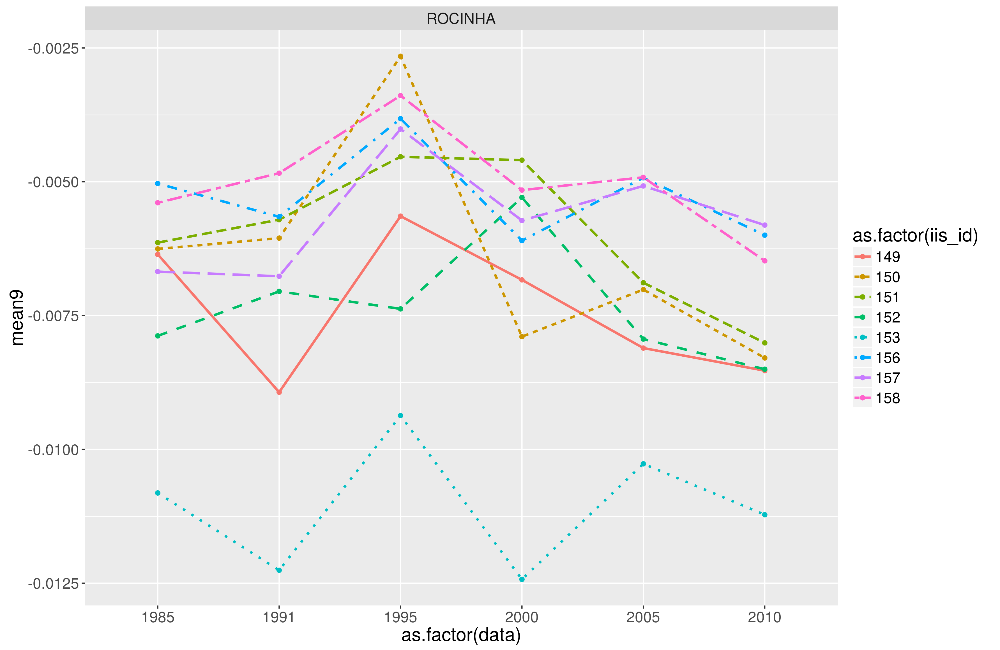
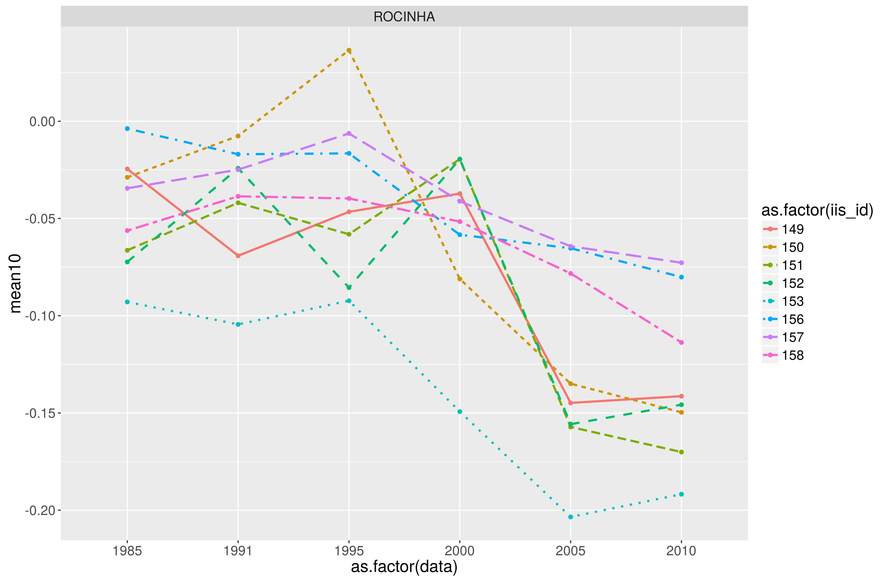
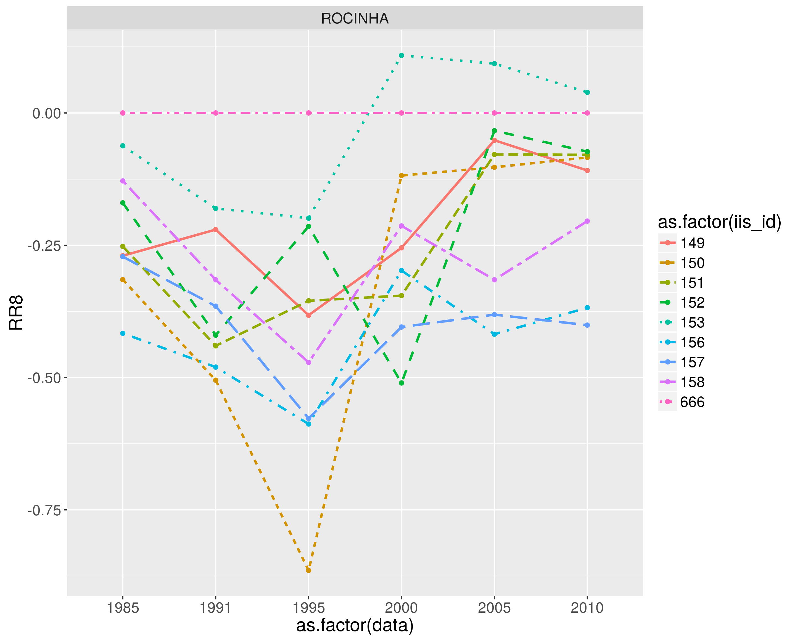
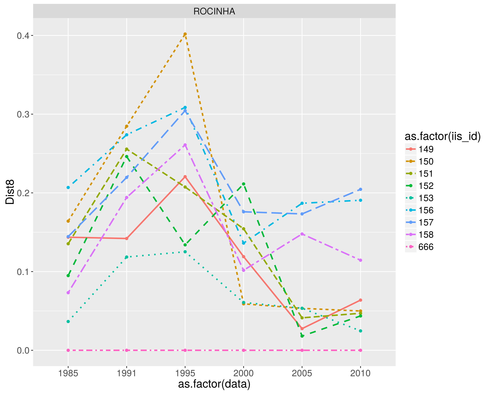

# The problem
Most of the time, remote sensing is used for land cover classification, being necessary to define whether or not a specific objetc is belongs to a class or another. When dealing with areas under restoration process, it is espected to have a gradual change in the area thru the time. Thus, would be more interesting to infer its evolution in a index manner than to classify the land cover (for instance identifying its membership to the forest class) in different moments.  
  
#About analysis proposal  
To overcome this challenge, a Forest Similarity Index (FSI) is proposed. The ideia behind of the Forest Similarity Index is to make use of vegetation index to monitor the restoration process thru the time.
  
#How to do it
There are several way we could propose this analysis. Due tis different approach, and inputs, would be interesting to identify its pors and cons. First point is to indentify the best vegetation index to be used as a proxy of forest evolution. Then, would be necessary to define the best approach: a) mean vegetation index; b) mean vegetation index similarity (i.e: the evolution compared to forest -reference- area); c) Response ratio of vegetation index (i.e: the response ratio evolution in relation to forest -reference- area);  
  
##Dataset used
To do so, six scenes of LandSat 5 TM of different years where selected. The assure consistency where selected imagery between May and August.  

Number  | year | date
------ | ----- | ----
1 | 1985 | 11/08
2 | 1991 | 31/05
3 | 1995 | 16/07
4 | 2000 | 25/05
5 | 2005 | 28/08
6 | 2010 | 09/07

  
From the raw satelitte imagery a atmospheric correction were processes using the "Dark Object Subtraction - DOS 1" as well as the transformation of the pixel value from Digital Number to Reflectance were done. 
  

Band Number  | spectral | reference
------------ | -------- | ---------
1 | 0,45 a 0,52 µm | azul
2 | 0,52 a 0,60 µm | verde
3 | 0,63 a 0,69 µm | vermelho
4 | 0,76 a 0,90 µm | infravermelho próximo
5 | 1,55 a 1,75 µm | infravermelho médio
6 | 10,4 a 12,5 µm | infravermelho termal
7 | 2,08 a 2,35 µm | infravermelho distante

  
From the landsat bands, we generated some indexes: NVI, EVI and SAVI.  
  

  Band Number  | spectral | reference
------------ | -------- | ---------
8 | $\frac{B_{NIR}-B_{Red}}{B_{NIR}+B_{Red}}$ | Índice Nomalizado de Vegetação (NDVI)
9 | $\frac{B_{NIR}-B_{Red}}{B_{NIR}+6*B_{Red}-7.5*B_{Blue}+1}$ | Índice de Vegetação Realçado (EVI)
10 | $\frac{B_{NIR}-B_{Red}}{B_{NIR}+B_{Red}+0.5}$ | Índice de Vegetação Ajustado ao Solo (SAVI)

  
### Abou vegetation Indexes
  
- **Normalized Vegetation Index:** Is widely used and known for sazonal and temporal vegetation status. It ranges from -1 to 1, indicating areas with low/hight photosintesis activities. This index is highly influenced by shadows, thus the expected relation between NDVI and biomass can not be true. In some cases it is possible to identify the opposite relation (hight values of NDVI in secondary forest and lower in old growth), due shadow occurrences.  
  
- **Soil Adjusted Vegetation Index:** Soil characters influences the radiation from sparse vegetation, hence in the vegetation index. Thus SAVI, imply a constant *L* in the index calculation to minimize the soil effects. In this case, we used *L*=0.5 which is defined for mean density. The *L* must be defined for each biome or ecossistem.  
  
- **Enhanced Vegetation Index:** Presents otimization for both soil and atmospheric influence on vegetation index, is mostly used in forest with high biomass densities.  
  
## Forest Similarity Index
The proposal can be based in tow approaches:  
  
- Temporal change ('evolution') of mean vegetation index (e.g: Normalized Difference Vegetation Index) the restoration polygon;
    + NDVI
    + EVI
    + SAVI
  
Once produced the unsupervised classification, the statistical results (not spatialy explicit) can be used to identify a statistical distance from one area (the area under munitoring) to its reference (in this case, forest area). It is expected that, bare soil areas have a bigger distance from the forest areas than a degraded forest.

## Case Study
We analised the restoration areas at Rocinha.  

## Mean Vegetation Index
### Mean Normalized Vegetation Index (NDVI) evolution
  

  
Pros:  
Cons:  

Why to use this one? why not?  
  
### Mean Enhanced Vegetation Index (EVI) 
  
  
  
Pros:  
Cons:  
  
Why to use this one? why not?  
  
### Mean Soil Adjusted Vegetation Index (SAVI) 
  
  
  
Pros:  
Cons:  
  
Why to use this one? why not?  
  
### Response ratio  
  
Response Ratio ($\log\frac{Param_{a}}{Param_{b}}$) can be used for any of the vegetation index, and must have one reference area. In this example, we are using NDVI.  
  

  
  
Pros:  
Cons: A reference area must be dificult to define, as its location (slope, oriantation) might influence in the vegetation index.  
  
Why to use this one? why not?  

Acredito que os valores precisam sercorrigidos, uma vez queestou considerando os valoresmédiosde DNVI (que por suavez variam de 1 a -1).

### Distance  
  
Euclidean distance from mean reference forest vegetation Index to mean vegetation index of restration areas. In this example, we are using NDVI.  
  

  
Pros:  
Cons: A reference area must be dificult to define, as its location (slope, oriantation) might influence in the vegetation index.  
  
Why to use this one? why not?  

## Others concerns  
  
  
1. some areas might be too small to be analysed with LandSat imagery (which has 30m spatial resolution)
  1.1 But we can define a minimun area to be analysed (like having more than 4 pixels)  
1. Measuring mean values is dangerous?  