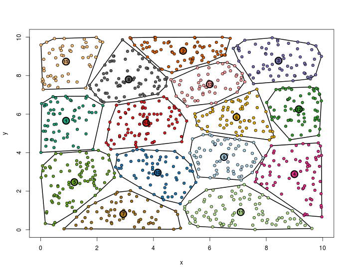
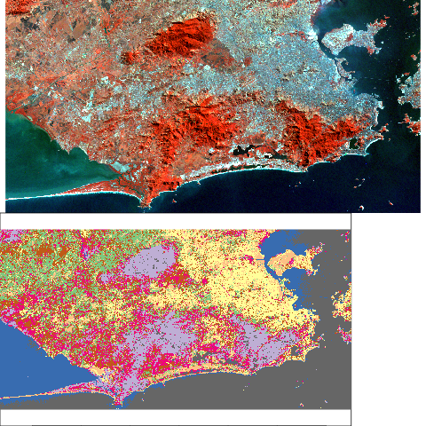
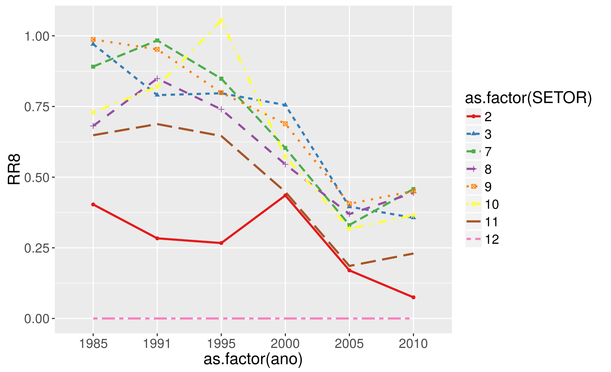
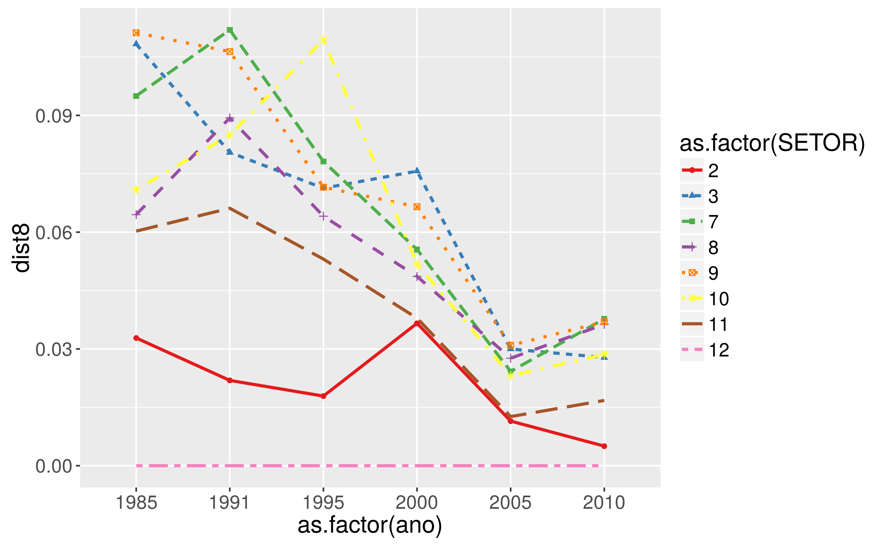
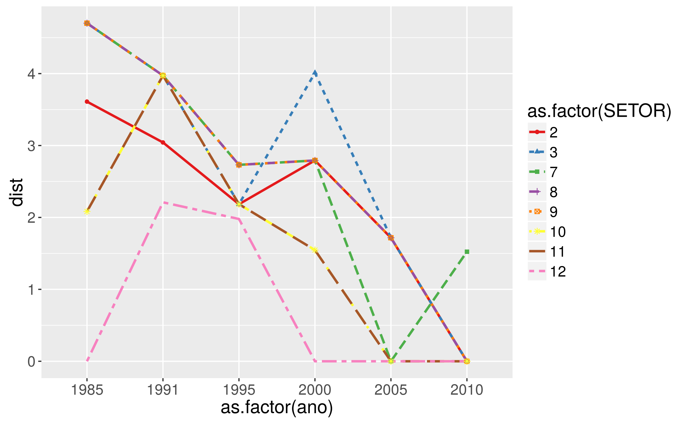

#About environmental monitoring with remote sensing
Remote sensing is widely known as a usefull tools for environmental analysis, monitoring and also in spatial planning. Remote sensing is mainly used for data aquisition for a specific date and study area. Most of the time, remote sensing is used for land cover classification, and along with sensors development, several algorithms have been developed enhancing the classification performance.  
One critical point of the land use/land cover classification approach is the fact that it is most of the time, dificult to identify the membership of a specific land cover. This is specifcly more difficult when dealing with areas under restoration or degradation.  
  
#About analysis proposal  
To overcome this challenge, a Forest Similarity Index (FSI) is proposed. The ideia behind of the Forest Similarity Index is to make use of the development of the classification algorithms not only to proceed a classification of different imagery for the entire study area for different dates, but also to monitor thru the time areas of restoration. As a case of study, the restoration area of Dois Irmãos will be used.    
  
##Dataset used
To do so, six scenes of LandSat 5 TM of different years where selected. The assure consistency where selected imagery between May and August.  

Number  | year | date
------ | ----- | ----
1 | 1985 | 11/08
2 | 1991 | 31/05
3 | 1995 | 16/07
4 | 2000 | 25/05
5 | 2005 | 28/08
6 | 2010 | 09/07

  
From the raw satelitte imagery a atmospheric correction were processes using the "Dark Object Subtraction - DOS 1" as well as the transformation of the pixel value from Digital Number to Reflectance were done. also, some indexes like NVI, EVI and SAVI where used for the final analysis.
  

Band Number  | spectral | reference
------------ | -------- | ---------
1 | 0,45 a 0,52 µm | azul
2 | 0,52 a 0,60 µm | verde
3 | 0,63 a 0,69 µm | vermelho
4 | 0,76 a 0,90 µm | infravermelho próximo
5 | 1,55 a 1,75 µm | infravermelho médio
6 | 10,4 a 12,5 µm | infravermelho termal
7 | 2,08 a 2,35 µm | infravermelho distante
8 | $\frac{B_{NIR}-B_{Red}}{B_{NIR}+B_{Red}}$ | Índice Nomalizado de Vegetação (NDVI)
9 | $\frac{B_{NIR}-B_{Red}}{B_{NIR}+6*B_{Red}-7.5*B_{Blue}+1}$ | Índice de Vegetação Realçado (EVI)
10 | $\frac{B_{NIR}-B_{Red}}{B_{NIR}+B_{Red}+0.5}$ | Índice de Vegetação Ajustado ao Solo (SAVI)

  
##Unsupervised Classification
For the unsupervised classification it is proposed the use of Fuzzy C-means algorithm. This algorithm uses fuzzy logic so that each pixel is not associated with only one cluster, but has a certain degree of membership for each of the existing clusters. The advantage of this algorithm is the possibility of having the image classified by machine laerning with several replication until the best clustering is found. This algorithm, like Kmeans, start clustering the pixels with the objective of minimizing the Mean Squared Error (MSE) - cluster variability. Thus, the cluster analysis identify groups  by splitting and merging of clusters reducing the variability within groups and increasing it between then (figure 1).  
    
  
From this analysis we can obtain an unsupervised classification for each year (figure 2), which can be further supervised classified to define for each cluster it class of land cover.  

  
##Forest Similarity Index
Once produced the unsupervised classification, the statistical results (not spatialy explicit) can be used to identify a statistical distance from one area (the area under munitoring) to its reference (in this case, forest area). It is expected that, bare soil areas have a bigger distance from the forest areas than a degraded forest.

###Dois irmãos
We ran this analisis for the restoration project in Dois Irmãos area. This restoration area in composed by 11 sectorsof restoration.But due landsat spatial resolution, only 8 could be analysed (by having more than 4 pixels)

### Análise usando response ratio  
  
Usando response ratio ($\log\frac{Param_{a}}{Param_{b}}$), tendo como parametro NDVI.  
  

  
Abordagem precisa de melhorias. Acredito que os valores precisam sercorrigidos, uma vez queestou considerando os valoresmédiosde DNVI (que por suavez variam de 1 a -1).
  
### Análise com distância entre valores médios de NDVI (setor/referência)  
  

  
Abordagem simples de distância dentre os valores médios de NDVI de cada setor à área de referência.
  
Comparando esta abordagem com a anterior (baseada no *responseratio*) percebe-se que as respostas são iguais, só mudando os valores observados.
  
### Análise com distancia entre valores médios entre grupos
  
  
  
Essa abordagem é menos sensível à mudanças locais uma vez que utiliza as distancias entre valores médios entre os grupos estatísticos obtidos pela análise de cluster (*Kmeans, fuzzy Kmeans*). Logo, diferentes áreas classificadas nos mesmos grupos terão mesmo valor de distância.
  
Comparando esta abordagem com as anteriores percebe-se, por estar relacionada com os grupos (clusters), as distâncias tendem a serem similares para diferentes áreas, pelas mesmas estarem classificadas em um mesmo grupo.
  